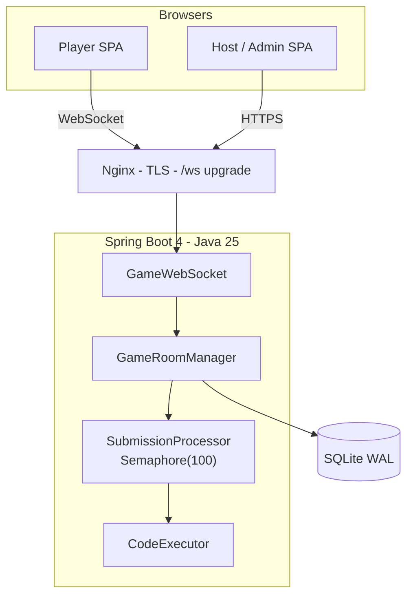
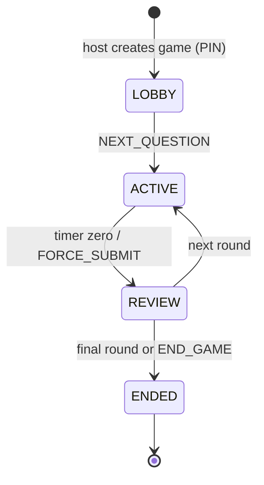
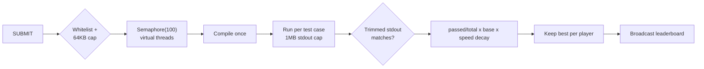

# OpenQuiz

**The open-source, real-time coding quiz platform with a built-in Online Judge.**

OpenQuiz pairs the live-host energy of a classroom game show with a multi-language code
execution engine. A host opens a room with a six-digit PIN, players join anonymously, and
everyone answers twelve different question types — from plain multiple choice to writing
real C, C++, Java, Node.js, or Python that is compiled and judged against hidden test
cases in real time.

- License: [GPLv3](LICENSE)
- Backend: Spring Boot 4 · Java 25 (virtual threads + ZGC) · JOOQ · Flyway · SQLite (WAL)
- Frontend: React 19 + TypeScript OOP services · RxJS · Zustand · Tailwind · GSAP
- Real time: vanilla Jakarta `@ServerEndpoint` WebSocket
- Docs: [VitePress site](docs/index.md)

---

## Why OpenQuiz

| | OpenQuiz | Typical quiz tools |
|---|---|---|
| Question formats | **12**, including two full Online-Judge modes | Mostly MCQ |
| Player answers | Real compiled code against hidden tests | Clickable choices only |
| Scoring | Kahoot-style speed decay, partial credit, attempt decay | Basic right/wrong |
| Database | Single portable SQLite file with WAL | External server required |
| Source | Open, auditable, self-hosted | Closed SaaS |

## Architecture



## Game lifecycle



## Online Judge pipeline



## The 12 question formats

| # | Type | Behavior |
|---|------|----------|
| 1 | `MCQ` | Four options, single choice |
| 2 | `TRUE_FALSE` | True / False buttons |
| 3 | `MULTIPLE_SELECT` | Checkboxes with partial scoring |
| 4 | `NUMERIC` | Number input with tolerance |
| 5 | `OUTPUT_PRED` | Code snippet plus four options |
| 6 | `FILL_BLANK` | Snippet with a `___` placeholder |
| 7 | `DRAG_SORT` | Drag scrambled lines into order |
| 8 | `CLICK_BUG` | Click the buggy line number |
| 9 | `CODE_COMPLETION` | Fill in missing lines in a light editor |
| 10 | `COMPLEXITY` | Big-O multiple choice |
| 11 | `OJ_FULL` | Full editor, judged against hidden tests |
| 12 | `OJ_PATCH` | Fix a buggy function, run the tests |

## Scoring

- **Selection questions:** correct answers earn a linear speed-decay bonus; wrong answers
  score exactly zero.
- **Multiple attempts:** second attempt earns 50% of base, third earns 25%, and so on
  (configurable through admin settings).
- **Coding questions:** unlimited attempts until the timer ends; `(passed / total) × base ×
  speed decay`, and only the highest-scoring submission is kept.
- **Leaderboard:** live updates broadcast after every submission.

## Quick start

### Windows (zero WSL setup required)

```powershell
scripts\check-env.ps1      # audit JDK, Node, compilers; guided fixes
scripts\run-tests.ps1      # run the full backend suite
scripts\dev-backend.ps1    # terminal 1 — API + WebSocket on :8080
scripts\dev-frontend.ps1   # terminal 2 — UI on :5173
```

The dev profile defaults to the `native` executor, which drives the toolchains directly —
no bash, no WSL. Set `OPENQUIZ_EXECUTOR_MODE=wsl` to run the same judge inside Ubuntu.

### Linux / macOS

```bash
mvn spring-boot:run                 # backend on :8080
cd frontend && npm install && npm run dev   # frontend on :5173
```

### Executor modes

| Mode | Environment | Isolation | Purpose |
|------|-------------|-----------|---------|
| `native` | Windows/Linux (dev + Windows prod) | None — whitelist/cap/timeout controls | Fastest first run; Windows production |
| `wsl` | Windows dev | Separate Linux VM | Parity with production scripts |
| `nsjail` | Linux production | chroot + rlimits | Always use on Linux production |

Production on Windows: `scripts\run-prod.ps1` builds the jar and starts it with ZGC;
`OPENQUIZ_DB_PATH` relocates the SQLite file (parent dirs auto-created).

### Admin authentication

Admins sign in through Microsoft Entra ID:

```bash
export OPENQUIZ_MS_CLIENT_ID=...
export OPENQUIZ_MS_CLIENT_SECRET=...
export OPENQUIZ_MS_TENANT_ID=common
```

## Security model

- **Host authorization:** WebSocket host commands require an authenticated OAuth2 session
  bound at the upgrade handshake plus a host-role join. One host per room.
- **No answer leakage:** question configs hold answer keys and hidden tests and are served
  exclusively through admin-authenticated endpoints.
- **Input hardening:** Jakarta Bean Validation on REST DTOs, WebSocket message schema
  checks, player-name whitelist (20 characters), 64KB source cap, language whitelist,
  CSRF tokens on cookie sessions.
- **Abuse bounds:** per-address JOIN rate limiting (10 failures/minute), 500-player room
  cap, 50 attempts per player per question, `Semaphore(100)` judge concurrency, 1MB stdout
  cap with process kill.
- **Transport headers:** HSTS, nosniff, deny frames, strict CSP, same-origin referrer;
  CORS defaults to the Vite dev origin and is configurable for production.

## Testing

The backend suite (JUnit 5 + Mockito, including XSS/SQL-injection hardening cases and a
500-concurrent-player stress test) runs green on Windows without WSL:

```powershell
scripts\run-tests.ps1     # or: mvn test
```

Playwright end-to-end specs target Chromium, Firefox, and WebKit:

```powershell
scripts\run-e2e.ps1
```

The frontend builds dual bundles through `@vitejs/plugin-legacy`, so the UI runs on
Chrome 49+, Safari 10+, and Firefox 52+ while evergreen browsers get modern output.

## Project layout

```
├── executor/compile-scripts/   c.sh cpp.sh java.sh node.sh python.sh
├── src/main/java/com/openquiz/
│   ├── config/                 App · Database · Security · WebSocket
│   ├── domain/                 enums · models · dto
│   ├── repository/             JOOQ DAOs (type-safe, no raw SQL)
│   ├── service/                rooms · scoring · judging · import/export
│   ├── websocket/              @ServerEndpoint endpoint + session manager
│   ├── controller/             Admin · Public
│   └── exception/              Global error mapping
├── src/main/resources/db/migration/   Flyway V1 schema
├── frontend/src/services/renderers/   abstract base + 12 renderers
├── docs/                       VitePress documentation site
└── scripts/                    Windows helper scripts
```

## Documentation

The full documentation lives in [`docs/`](docs/index.md): getting started, player and
admin guides, architecture diagrams, database schema, API reference, WebSocket protocol,
and deployment. Build it locally with:

```bash
cd docs && npm install && npm run docs:dev
```

## Contributing

One file per commit. Use `feat(scope): description` or `fix(scope): description`.
Strict OOP on both sides; no raw SQL; no `any` in TypeScript; flat UI only — no
glassmorphism, gradients, or glow effects. See [the contributing guide](docs/contributing.md).

## License

[GNU GPL v3](LICENSE) — free software, copyleft protected.
