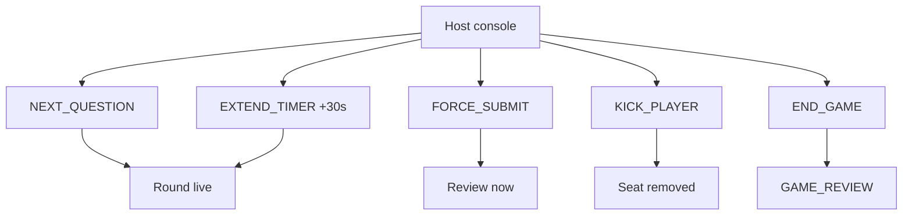
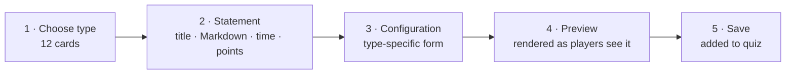
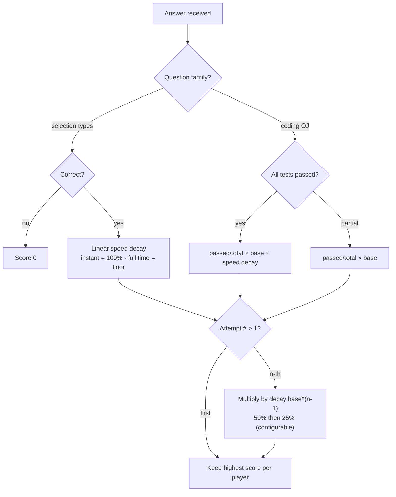
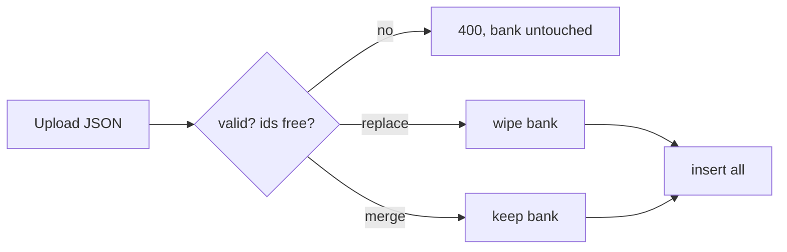

# Admin Guide

The admin panel sits behind a username/password form login at `/admin/login`.

## Creating a quiz

1. From the Admin dashboard, fill in **Quiz title** and **Description**, then click **Add**.
2. Open the quiz to see its question list.

## The question wizard (12 types)

Launch the wizard with **+ Question**. It has four steps:

1. **Choose Type** — grid of 12 cards (MCQ, TRUE_FALSE, MULTIPLE_SELECT, NUMERIC,
   OUTPUT_PRED, FILL_BLANK, DRAG_SORT, CLICK_BUG, CODE_COMPLETION, COMPLEXITY,
   OJ_FULL, OJ_PATCH).
2. **Statement** — title, Markdown description, time limit, base points.
3. **Configuration** — a dynamic form per type (options, test cases, bug line, etc.).
4. **Preview** — rendered exactly as players will see it.

You can also create questions live during a lobby and add them to the queue.

## Hosting a game

Click **Host** on a quiz to generate a 6-digit PIN. Share the invite link
`/j/<PIN>` (or the on-screen QR code, which encodes the same URL) — it works
logged-out. Use the host controls to start rounds,
force-submit, extend the timer (+30s per call, clamped to 1..300s, capped at +300s over the round
deadline), kick players, and end the game. The live leaderboard
updates after every submission and never includes the host.

The dashboard has five tabs (Dashboard, Quizzes, Questions, Games, Settings);
Games and Settings beyond the basics are still stubs. Team battles need at
least 2 contestants besides the host; odd players wait for the next round.

## Wizard and scoring at a glance

## Import / Export

- **Export** downloads the entire question bank as a single JSON document.
- **Import** validates and (optionally) replaces the bank. The schema is documented in the
  API Reference.

## Question types at a glance

| # | Type | Behavior |
|---|------|----------|
| 1 | MCQ | A/B/C/D radio buttons |
| 2 | TRUE_FALSE | True / False buttons |
| 3 | MULTIPLE_SELECT | Checkboxes, partial scoring |
| 4 | NUMERIC | Number input with tolerance |
| 5 | OUTPUT_PRED | Code snippet + 4 MCQ options |
| 6 | FILL_BLANK | Snippet with `___`, text input |
| 7 | DRAG_SORT | Scrambled lines, drag to order |
| 8 | CLICK_BUG | Click the buggy line |
| 9 | CODE_COMPLETION | Write missing lines |
| 10 | COMPLEXITY | Big-O MCQ |
| 11 | OJ_FULL | Full Monaco editor, hidden tests |
| 12 | OJ_PATCH | Edit a buggy function, run tests |
