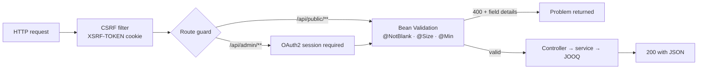

# API Reference

All REST endpoints under `/api/admin/**` require an authenticated admin (OAuth2). Public
endpoints are under `/api/public/**`.

## Request lifecycle



## Public

| Method | Path | Description |
|--------|------|-------------|
| GET | `/api/public/quizzes` | List all quizzes |
| GET | `/api/public/quizzes/{id}` | Quiz with its questions |
| POST | `/api/public/games` | Create a game from a quiz (`{ quizId, hostUserId }`) → returns PIN |

## Admin

| Method | Path | Description |
|--------|------|-------------|
| GET | `/api/admin/quizzes` | List quizzes |
| POST | `/api/admin/quizzes` | Create quiz (validated) |
| DELETE | `/api/admin/quizzes/{id}` | Delete quiz |
| GET | `/api/admin/quizzes/{id}/questions` | List questions |
| POST | `/api/admin/quizzes/{id}/questions` | Add question (validated) |
| PUT | `/api/admin/questions/{id}` | Update question (validated) |
| DELETE | `/api/admin/questions/{id}` | Delete question |
| GET | `/api/admin/settings` | Admin settings map |
| PUT | `/api/admin/settings` | Update settings |
| POST | `/api/admin/games` | Create a game for a quiz; host is resolved from the OAuth2 session |
| GET | `/api/admin/export` | Export entire bank as JSON |
| POST | `/api/admin/import` | Import bank (`{ json, replace }`) |
| GET | `/api/admin/metrics` | Runtime metrics: memory/GC/threads, judge latency percentiles, compile-cache ratio, write-buffer depth |

Question payloads embed answer keys in their `config`, so they are admin-only by design —
the public surface never exposes them.

## Export JSON schema

```json
{
  "version": "1.0",
  "exportedAt": 1234567890,
  "quizzes": [
    {
      "id": "qz1",
      "title": "Algorithms 101",
      "description": "...",
      "questions": [
        {
          "id": "q1",
          "type": "MCQ",
          "title": "...",
          "description": "...",
          "timeLimitSec": 30,
          "pointsBase": 100,
          "config": { "options": ["A","B","C","D"], "correctIndex": 0 },
          "languagesAllowed": null
        }
      ]
    }
  ],
  "adminSettings": { "default_time_limit": "60", "mcq_max_attempts": "1" }
}
```

## Validation

Request bodies are validated with Jakarta Bean Validation (`@NotBlank`, `@Size`, `@Min`,
`@Valid`). Invalid input returns `400 Bad Request` with the failing fields; malformed JSON
also returns `400`.

## CSRF and headers

Cookie-session auth is protected by CSRF tokens (XSRF-TOKEN cookie echoed as X-XSRF-TOKEN;
axios does this automatically). Responses carry HSTS, `X-Content-Type-Options: nosniff`,
a locked-down Content-Security-Policy, `frame-ancestors 'none'` and a same-origin referrer
policy. CORS defaults to the Vite dev origin; configure `sprintjudge.cors.allowed-origins`
in production.
