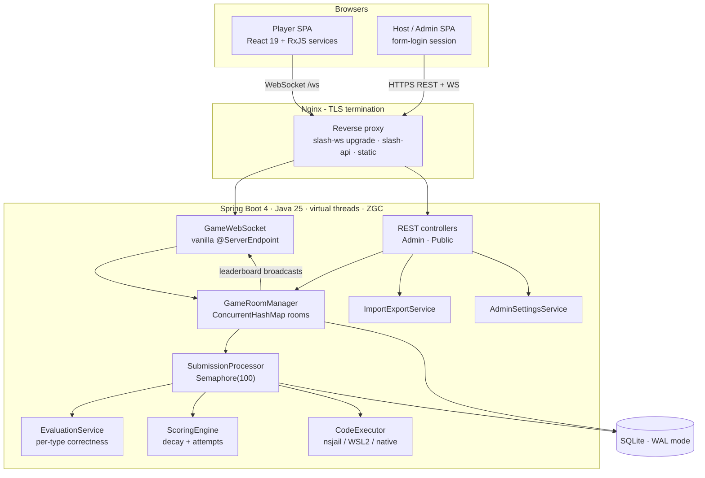
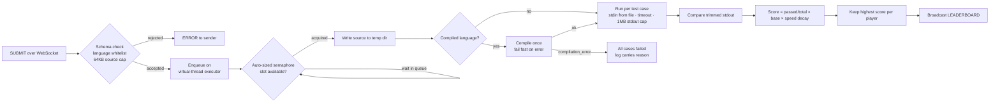
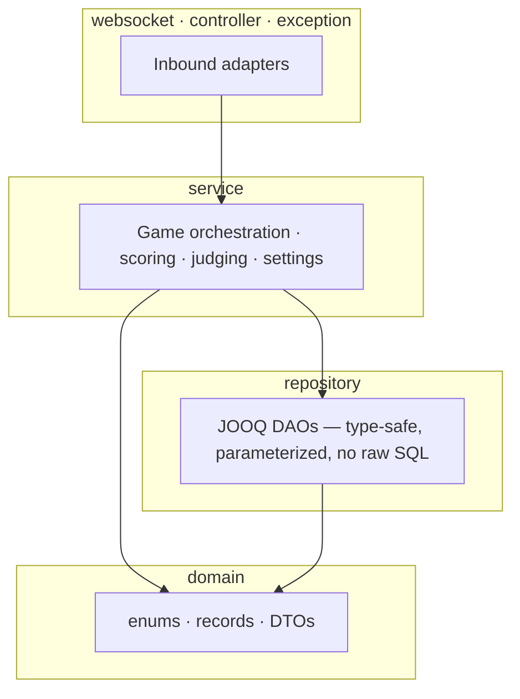
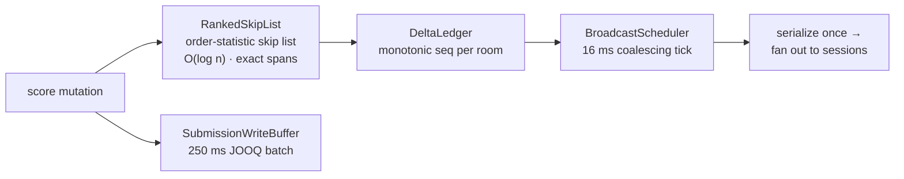

# Architecture

SprintJudge is a Spring Boot 4 monolith with a vanilla Jakarta WebSocket endpoint and a
React 19 single-page frontend. Everything runs on a single portable SQLite database.

## System overview



## Game state machine

A session walks a strict lifecycle. The host drives transitions; players never can.

```mermaid
stateDiagram-v2
    [*] --> LOBBY: host creates game (6-digit PIN)
    LOBBY --> ACTIVE: NEXT_QUESTION
    ACTIVE --> REVIEW: timer hits zero or FORCE_SUBMIT
    REVIEW --> ACTIVE: NEXT_QUESTION (more questions)
    REVIEW --> ENDED: NEXT_QUESTION (last question) or END_GAME
    ENDED --> [*]
    note right of ACTIVE: coding submissions stay queued<br/>on the auto-sized semaphore; force-submit<br/>never preempts them
```

## Submission pipeline (Online Judge)



## Module layering



## Performance architecture (10k players/room)

Three exact, lock-light structures carry the hot path:



- `RankedSkipList` — Redis zskiplist spans; rank/select are exact, ties by join order.
- `DeltaLedger` — merges pending changes per player; clients resync on any seq gap.
- `LiveLeaderboard` — binds identity map + index + ledger behind one facade.
  The host holds a roster seat only and never enters the scored board.
- `ExecutorSizingConfig` — judge concurrency is `cores × factor` (floor 8, cap 512),
  overridable via `sprintjudge.executor.max-concurrent`.
- `RoomRegistry` — int-keyed open-addressing map for thousands of rooms.
- `CompileArtifactCache` — SHA-256 keyed binaries for identical C/C++ resubmits.
- `/api/admin/metrics` — heap/GC/threads, judge latency percentiles, cache ratio.

## Executor modes

| Mode | Where | Isolation | Use when |
|------|-------|-----------|----------|
| `native` | Windows/Linux dev | None (dev only) | Fastest setup; toolchains on PATH |
| `wsl` | Windows dev | Separate Linux VM | Parity with production scripts |
| `nsjail` | Linux production | chroot + rlimits | Always, in production |
