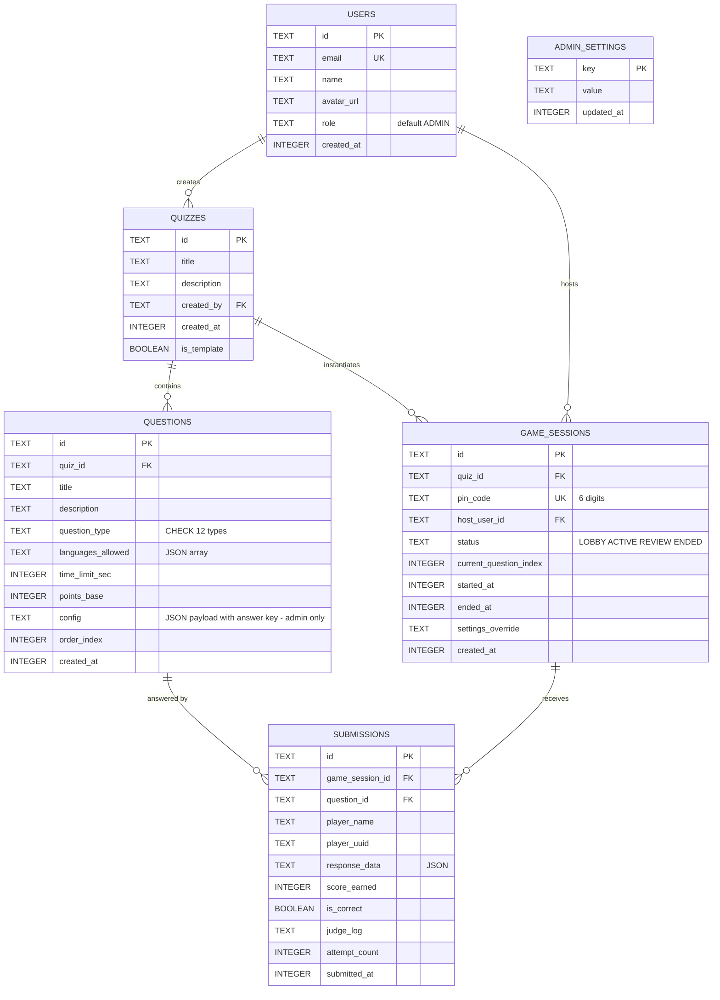

# Database Schema

SprintJudge uses a single portable SQLite file with WAL journaling. All access goes through
parameterized JOOQ queries; migrations run via Flyway.

## Indices

| Table | Index | Purpose |
|-------|-------|---------|
| `game_sessions` | `pin_code` | Fast lobby join lookups |
| `questions` | `(quiz_id, order_index)` | Ordered question fetch per quiz |
| `submissions` | `(game_session_id, question_id)` | Round result aggregation |
| `submissions` | `(game_session_id, player_name)` | Per-player attempt history |

## Operational notes

- **WAL mode** is enabled in the JDBC URL, along with a 5-second busy timeout and
  foreign-key enforcement, so readers never block the single writer for long.
- The database is one portable file: back it up with any file copy while idle.
- Production should run a weekly checkpoint:
  `sqlite3 /var/lib/sprintjudge/sprintjudge.db "PRAGMA wal_checkpoint(TRUNCATE);"`
- Question `config` payloads embed answer keys and hidden test cases — they are exposed
  exclusively through admin-authenticated endpoints.
