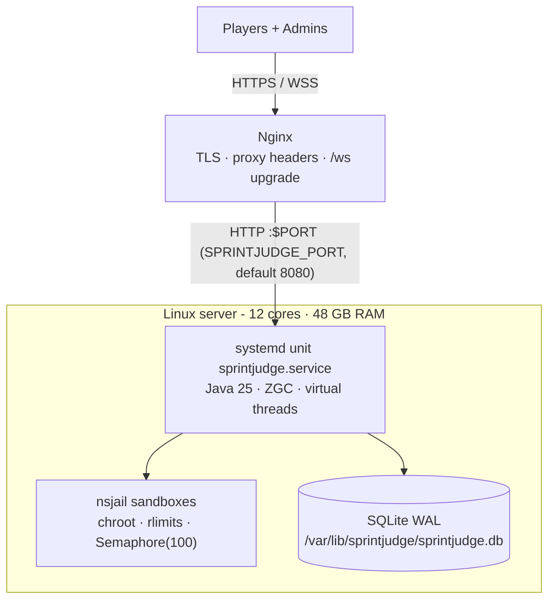
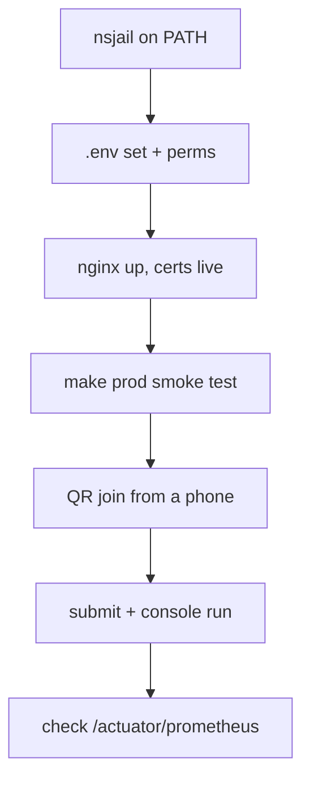

# Deployment

## Production topology



## Windows production

`prod` runs on Windows too. The `native` executor drives gcc/g++/javac/node/python
directly (no nsjail on Windows), and the database defaults to a portable relative path.

```bash
make prod          # builds target/sprintjudge.jar and starts it with ZGC
# optional environment:
#   SPRINTJUDGE_DB_PATH=D:\data\sprintjudge.db
#   SPRINTJUDGE_PORT=3000
#   SPRINTJUDGE_EXECUTOR_MODE=native
```

The parent directory of `SPRINTJUDGE_DB_PATH` is created automatically on first boot.
Without an explicit path, the database (and a `.env` file if present) lives next to
the running jar, so the whole deployment is one folder you can copy around.
Verify any Windows launch in one command:

```bash
make verify-prod SKIP_BUILD=1   # boots prod, checks the REST health endpoints
```

For hardened Linux hosts keep `SPRINTJUDGE_EXECUTOR_MODE=nsjail` (the systemd unit already
pins it); on Windows, prefer running the JVM under a dedicated service account and rely
on the executor's whitelist, source cap, timeout-kill, and stdout-cap controls.

## Production (Linux — 12 cores / 48GB RAM)

- Run as a systemd service (see `deploy/sprintjudge.service`) with `-XX:+UseZGC` and virtual threads.
- The unit pins `--sprintjudge.executor.mode=nsjail` and reads an optional
  `/opt/sprintjudge/.env` for PORT, DB path and admin credentials.
- Nginx reverse proxy terminates TLS and upgrades `/ws` to WebSocket (see `deploy/nginx-sprintjudge.conf`).
  Both locations forward `X-Forwarded-For`/`X-Real-IP` so rate limiting sees
  real client IPs. Upstream is `127.0.0.1:8080` — match it with SPRINTJUDGE_PORT.
- Set `SPRINTJUDGE_COOKIE_SECURE=true` behind TLS nginx.
- Use the `prod` profile: `SPRINTJUDGE_EXECUTOR_MODE=nsjail`, executor `nsjail` binary on `PATH`.
- Weekly SQLite WAL checkpoint:

```bash
sqlite3 /var/lib/sprintjudge/sprintjudge.db "PRAGMA wal_checkpoint(TRUNCATE);"
```

Go-live checklist:



## Development (Windows)

- Use the `dev` profile; the executor defaults to `native` toolchains, with WSL2
  Ubuntu opt-in via `SPRINTJUDGE_EXECUTOR_MODE=wsl`.
- `spring.profiles.active=dev`.

## Concurrency

Executions are throttled by an auto-sized semaphore (`cores ×
sprintjudge.executor.concurrency-factor`, floor 8, cap 512; override with
`sprintjudge.executor.max-concurrent`).
Stdout is capped at 1MB per test case; processes exceeding it are killed. Source is capped
at 64KB and attempts at 50 per player per question.

## Proxy headers

The WebSocket rate limiter keys on `X-Forwarded-For` (falling back to `X-Real-IP`).
Configure nginx to set both so per-client limiting is accurate:

```
proxy_set_header X-Forwarded-For $proxy_add_x_forwarded_for;
proxy_set_header X-Real-IP $remote_addr;
```
