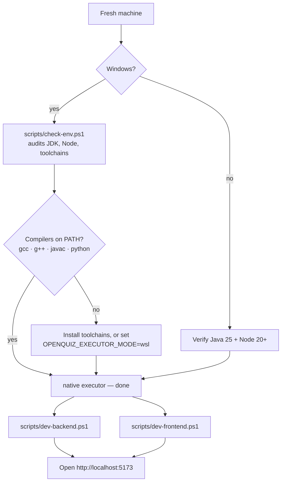

# Getting Started

OpenQuiz runs as a Spring Boot backend (port `8080`) and a Vite/React frontend (port `5173`).

## Pick your setup path



## Prerequisites

- Java 25 (virtual threads + ZGC enabled by default)
- Maven 3.9+ (or nothing at all — the bundled `mvnw.cmd` wrapper downloads it)
- Node.js 20+
- Linux production: `nsjail` on `PATH`
- Windows development: native compilers (`gcc`, `g++`, `javac`, `python`) for the default
  `native` mode, or WSL2 Ubuntu with the same packages for the `wsl` mode

## Run the backend

```bash
mvn spring-boot:run
```

Profiles: `dev` (default; `native` or `wsl` executor) and `prod` (`nsjail`). Configure the
executor and database in `src/main/resources/application.yml`.

## Run the frontend

```bash
cd frontend
npm install
npm run dev
```

The Vite dev server proxies `/api` and `/ws` to `http://localhost:8080`.

## Windows quick start

No WSL required. From PowerShell at the repo root:

```powershell
scripts\check-env.ps1      # one-time environment audit with guided fixes
scripts\run-tests.ps1      # prove the backend suite green on your box
scripts\dev-backend.ps1    # terminal 1 — API + WebSocket on :8080
scripts\dev-frontend.ps1   # terminal 2 — UI on :5173 (proxies /api and /ws)
```

The dev profile defaults to the `native` executor: toolchains are invoked directly, so a
fresh machine only needs its compilers on PATH. Set `OPENQUIZ_EXECUTOR_MODE=wsl` to run
the same judge inside Ubuntu instead.

## Admin authentication

Admins authenticate via Microsoft Entra ID OAuth2. Provide the following environment
variables before using the admin panel:

```bash
export OPENQUIZ_MS_CLIENT_ID=...
export OPENQUIZ_MS_CLIENT_SECRET=...
export OPENQUIZ_MS_TENANT_ID=common
```

## First run

1. Sign in as admin at `/login`.
2. Create a quiz, add questions via the 12-step wizard.
3. Click **Host** to generate a 6-digit PIN.
4. Players join at the join screen with the PIN and a nickname.
