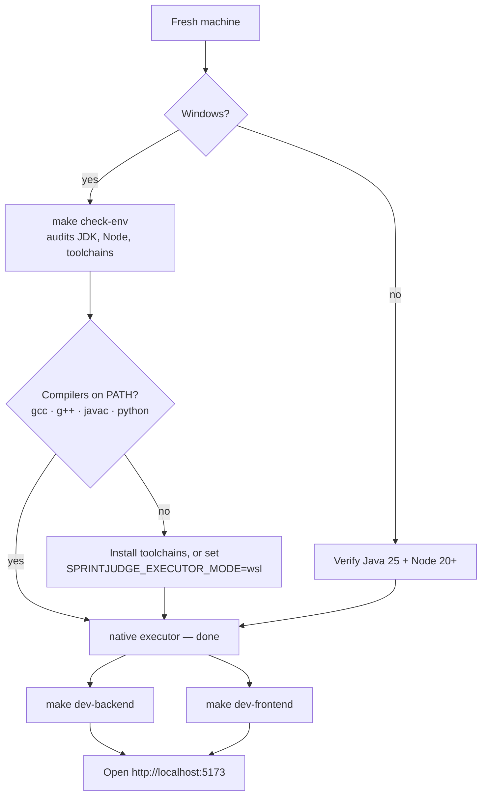
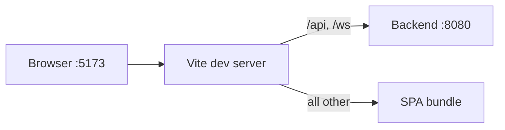

# Getting Started

SprintJudge runs as a Spring Boot backend and a Vite/React frontend. In dev the
backend listens on `:8080` and the UI on `:5173`; the production fat jar listens
on `$SPRINTJUDGE_PORT` (default `:8080` — the repo `.env` ships `3000`).

## Pick your setup path



## Prerequisites

- Java 25 (virtual threads + ZGC enabled by default)
- Maven 3.9+ (or nothing at all — the bundled `mvnw.cmd` wrapper downloads it)
- Node.js 20+
- Linux production: `nsjail` on `PATH`
- Windows development: native compilers (`gcc`, `g++`, `javac`, `python`) for the default
  `native` mode, or WSL2 Ubuntu with the same packages for the `wsl` mode

## Run the backend

```bash
mvn spring-boot:run
```

Profiles: `dev` (default; `native` executor) and `prod` (`nsjail` on Linux).
Configure the executor and database in `src/main/resources/application.yml`.

## Port map

| Surface | Default | Override |
|---------|---------|----------|
| Backend dev (`mvn spring-boot:run`) | :8080 | application.yml |
| Frontend dev (`npm run dev`) | :5173 | vite.config.ts |
| Fat jar prod | :8080 | SPRINTJUDGE_PORT (repo .env ships 3000) |
| Prod verifier | :8091 | make verify-prod PORT=... |

The Vite dev server proxies `/api` and `/ws` to `http://localhost:8080`.

## Run the frontend

```bash
cd frontend
npm install
npm run dev
```



## Environment variables (all optional)

| Variable | Default | Effect |
|----------|---------|--------|
| SPRINTJUDGE_PORT | 8080 | Prod jar listen port |
| SPRINTJUDGE_DB_PATH | next to jar / ./sprintjudge.db | SQLite file (forward slashes) |
| SPRINTJUDGE_EXECUTOR_MODE | native dev, nsjail prod | native, wsl, or nsjail |
| SPRINTJUDGE_CORS_ALLOWED_ORIGINS | http://localhost:5173 | Extra browser origins |
| SPRINTJUDGE_ADMIN_USERNAME | admin | Form-login username |
| SPRINTJUDGE_ADMIN_PASSWORD | changeme | Form-login password (change it) |
| SPRINTJUDGE_COOKIE_SECURE | false | true behind TLS nginx |
| SPRINTJUDGE_AI_ENABLED | false | AI feedback on failed cases |
| SPRINTJUDGE_AI_PROVIDER | openai | openai or llamacpp |
| SPRINTJUDGE_AI_ENDPOINT | — | e.g. http://localhost:11434/v1 |
| SPRINTJUDGE_AI_MODEL | gpt-3.5-turbo | Model name |
| SPRINTJUDGE_AI_API_KEY | — | Empty for local llama.cpp |
| SPRINTJUDGE_AI_TIMEOUT_SEC | 30 | AI call budget |

## Quick start (GNU Make)

No WSL required. From a shell with GNU Make at the repo root:

```bash
make check-env          # one-time environment audit
make test               # prove the backend suite green on your box
make dev-backend        # terminal 1 — API + WebSocket on :8080
make dev-frontend       # terminal 2 — UI on :5173 (proxies /api and /ws)
make prod               # single-jar production: UI + API + bundled library
make verify-prod        # boot prod and probe the REST health endpoints
```

The dev profile defaults to the `native` executor: toolchains are invoked directly, so a
fresh machine only needs its compilers on PATH. Set `SPRINTJUDGE_EXECUTOR_MODE=wsl` to run
the same judge inside Ubuntu instead. The production build bundles the compiled frontend
and the graded starter library into one fat jar — first launch creates and seeds the
SQLite database automatically (only when the bank is empty).

## Admin authentication

Admins sign in with a username and password via form login at `/admin/login`
(session cookie, same-origin). Set the credentials as OS environment variables
or in a `.env` file (see `.env.example`):

```dotenv
SPRINTJUDGE_ADMIN_USERNAME=admin
SPRINTJUDGE_ADMIN_PASSWORD=change-me-please
```

OS environment variables always win over `.env`. (OAuth2/Entra ID support exists
in the codebase but is unwired in the MVP chain.)

## First run

1. Sign in as admin at `/admin/login`.
2. Create a quiz, add questions via the 4-step wizard.
3. Click **Host** to generate a 6-digit PIN.
4. Players join with the PIN and a nickname — either at the join screen or
   directly via the invite link `/j/<PIN>` (the same URL the host's QR code
   encodes). No account needed.
