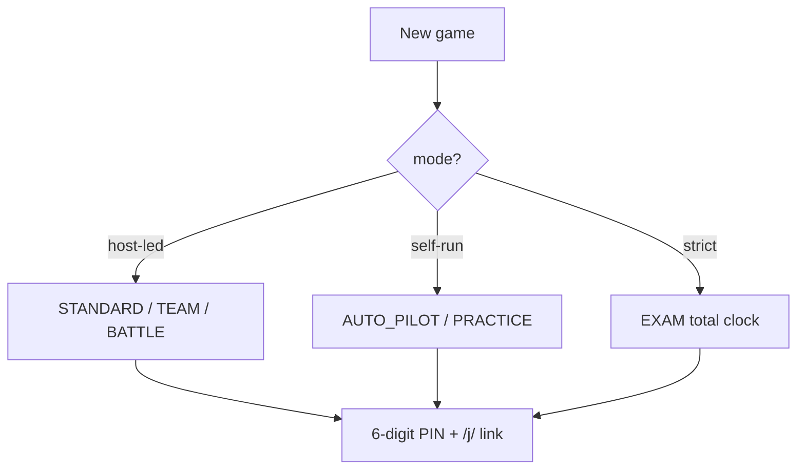

## Game modes

| Mode | Timer | Board | Notes |
|------|-------|-------|-------|
| STANDARD | per question | At review | Classic host-led game |
| AUTO_PILOT | per question | At review | Auto-advances after review |
| PRACTICE | none | Live | Instant feedback, auto-advance |
| EXAM | total clock | Hidden till end | Rankings only in GAME_REVIEW |
| TEAM | per question | At review | Create/join teams, team scoring |
| BATTLE | per question | At review | 1v1 matchmaking + bracket |

