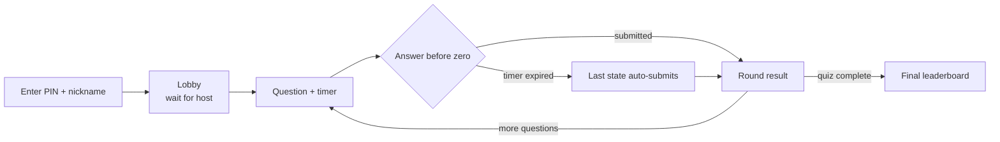

# Player Guide

Players join **anonymously** — no account required.

## Your path through a game

## Joining a game

1. Open the join screen.
2. Enter the 6-digit PIN shown by the host.
3. Enter a nickname (alphanumerics, spaces, hyphens, underscores; max 20 chars).
4. You appear in the host lobby.

## During a round

- Each question appears with a countdown timer.
- Submit before the timer hits zero; the last state auto-submits at zero.
- Coding questions (OJ_FULL, OJ_PATCH) allow unlimited attempts until the timer ends —
  only your highest-scoring submission is kept.
- Your in-progress code is cached in `localStorage` (`sprintjudge_code_<questionId>`) and
  restored if you refresh, then cleared on submit or when the timer ends.

## Scoring

- Selection questions: correct answers earn a linear speed-decay bonus; wrong = 0.
- Multiple attempts: 2nd = 50% of base, 3rd = 25%, and so on (admin-configurable).
- Coding questions: `(passed / total) * basePoints * speedDecay(if fully solved)`.

## Disconnect behavior

Guest sessions are ephemeral. If you disconnect, your score for missed rounds is 0, and
rejoining starts you fresh.
