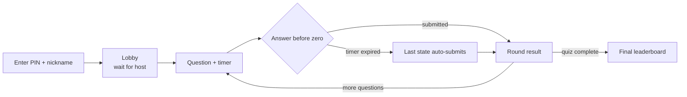
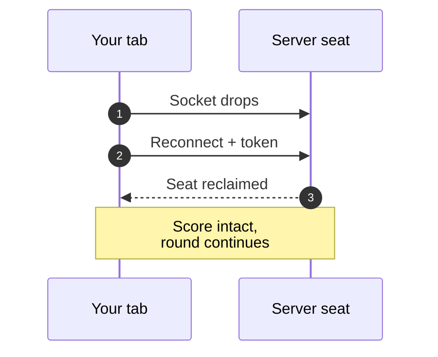

# Player Guide

Players join **anonymously** — no account required.

## Your path through a game

## Joining a game

1. Open the join screen — or the invite link `/j/<PIN>` directly (this is also
   what the host's QR code encodes; it works logged-out).
2. Enter the 6-digit PIN shown by the host.
3. Enter a nickname (alphanumerics, spaces, hyphens, underscores; max 20 chars).
4. You appear in the host lobby.

## Header buttons

- **Speaker** — toggles all game sounds (8-bit SFX + procedural music). Persisted.
- **Running figure** — cycles the motion preference: `system` (follow the OS
  reduced-motion setting) → `full` (always animate) → `reduced` (no animation:
  confetti, pulses, shakes and page transitions all stay off). Persisted.

## During a round

- Each question appears with a countdown timer.
- Submit before the timer hits zero; the last state auto-submits at zero.
- A click and the timer in the same instant still counts once.
- Coding questions (OJ_FULL, OJ_PATCH) allow up to 50 attempts per question —
  only your highest-scoring submission is kept.
- Your in-progress code is cached in `localStorage` (`sprintjudge_code_<questionId>`) and
  restored if you refresh, then cleared on submit or when the timer ends. Drafts
  never leak into the next game.
- The live console compiles and runs your code with optional stdin
  (10KB cap, 10s budget, 30 runs/min per IP) before you submit.

Reconnect lap:

## Scoring

- Selection questions: correct answers earn a linear speed-decay bonus; wrong = 0.
- Multiple attempts: 2nd = 50% of base, 3rd = 25%, and so on (admin-configurable).
- Coding questions: `(passed / total) * basePoints * speedDecay(if fully solved)`.

## Disconnect behavior

If the socket drops mid-game, the client auto-rejoins with its session token and
your score survives. A full page reload loses the token and starts you fresh.

## Leaderboard

The leaderboard only ever contains players — the host holds a roster seat but is
never scored and never appears in the rankings.
