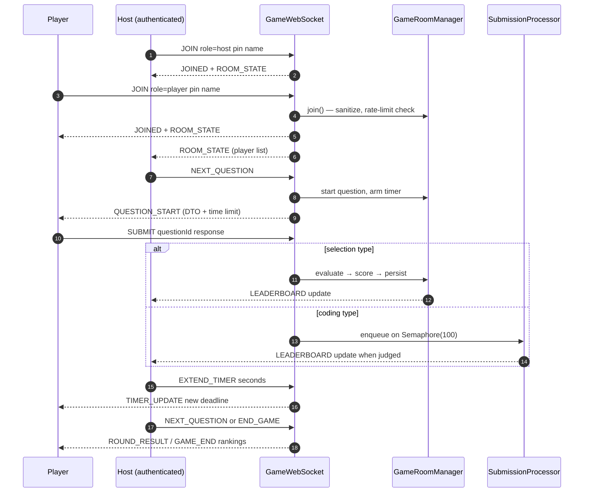

# WebSocket Protocol

The game uses a single vanilla Jakarta @ServerEndpoint at /ws. Messages are JSON with a "type" field.

## Typical session

## Client to Server

JOIN: { "type": "JOIN", "role": "player", "name": "Alice", "pin": "123456" }

SUBMIT: { "type": "SUBMIT", "questionId": "q123", "language": "python", "response": { ... } }

Host or admin commands: NEXT_QUESTION, FORCE_SUBMIT, END_GAME, EXTEND_TIMER (with "seconds"), KICK_PLAYER (with "playerUuid").

Any connected client may send: RESYNC_LEADERBOARD (no fields) after detecting a seq gap.

### Message schema validation

- A message must declare a non-empty "type".
- JOIN requires "pin" and "name".
- SUBMIT requires "questionId" and a "response" payload.
- SUBMIT language must be one of: c, cpp, java, node, python. Source is capped at 64KB.

## Authorization

- Host commands (NEXT_QUESTION, FORCE_SUBMIT, END_GAME, EXTEND_TIMER, KICK_PLAYER) require
  the connection to have joined with role "host" AND carry an authenticated OAuth2 session
  from the upgrade request. Players can never issue them.
- Only one host per room; a second host join is rejected.
- JOIN attempts are rate limited per client address: 10 failures per minute, reset on success.
- Rooms are capped at 500 players. EXTEND_TIMER seconds are clamped to 1..300.

## Server to Client

| Type | Contents |
|------|----------|
| ROOM_STATE | players, status, question count |
| QUESTION_START | full question DTO, time limit, start timestamp |
| ROUND_RESULT | scores per player, correct answer |
| LEADERBOARD_DELTA | seq, resync flag, exact rank upserts since last seq |
| LEADERBOARD | legacy full rankings (game end) |
| GAME_END | final rankings |
| ERROR | message |
| TIMER_UPDATE | new end timestamp, extend seconds |

### Leaderboard accuracy contract

Every mutation bumps a per-room monotonic `seq`; deltas carry exact 1-based ranks
computed from an order-statistic skip list. A client that sees a seq gap sends:

RESYNC_LEADERBOARD: { "type": "RESYNC_LEADERBOARD" }

and receives one authoritative batch with `"resync":true` to apply as a wholesale
replacement. No drift, no approximations.

## Edge cases on the wire

- Player names are sanitized (alphanumerics, spaces, hyphens, underscores; max 20 chars) before they enter any broadcast.
- Force-submit does not preempt in-flight judge tasks; it only reveals the current round result.
