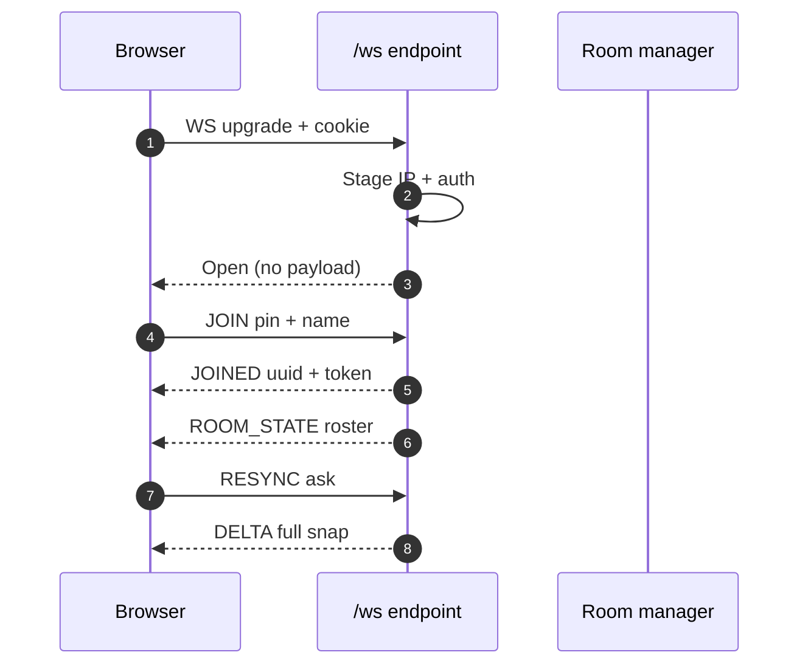
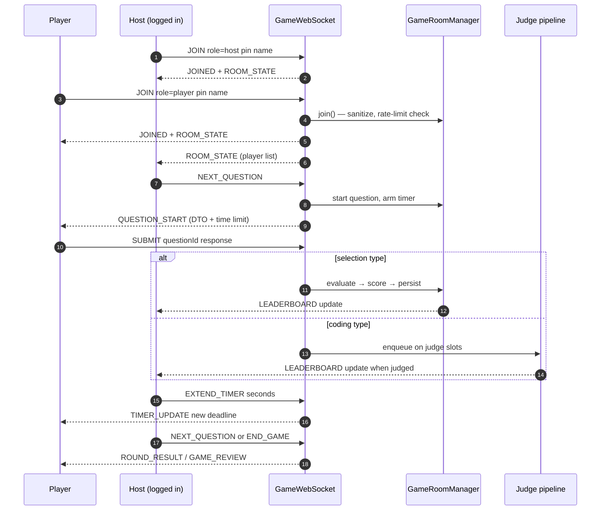
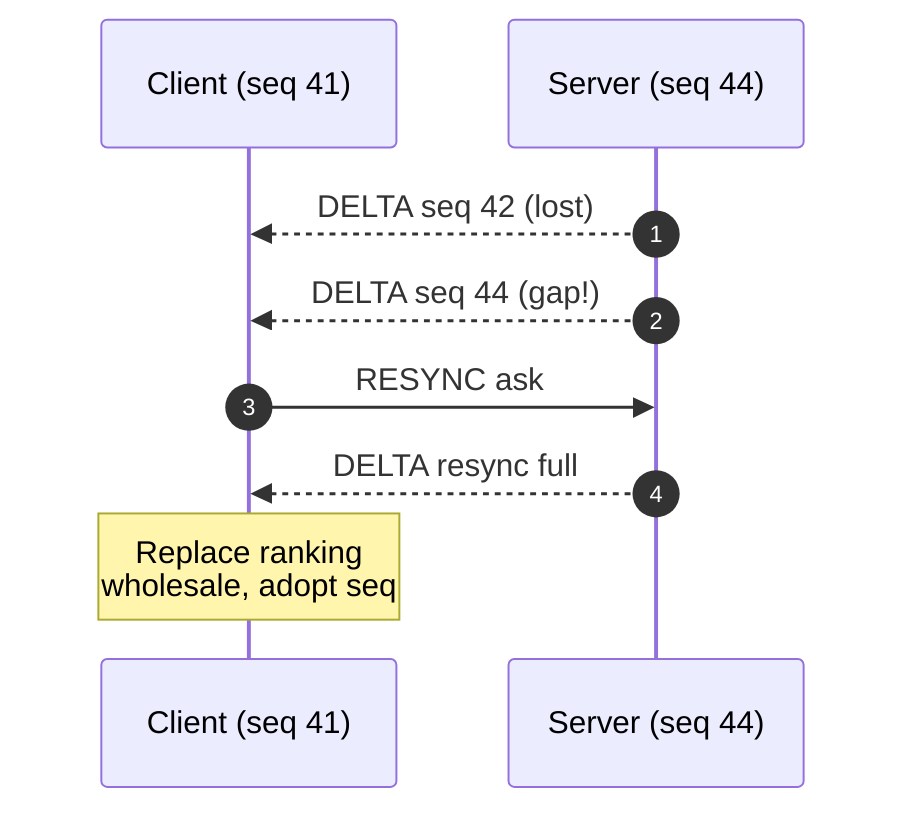

# WebSocket Protocol

The game uses a single vanilla Jakarta @ServerEndpoint at /ws. Messages are JSON with a "type" field.

## Connection preconditions



The submit identity always comes from the server-side session, never from a
client-supplied uuid. Host commands additionally require the connection to
have joined with role "host" AND an authenticated login session.

## Typical session



## Client to Server

| Type | Required fields | Notes |
|------|-----------------|-------|
| JOIN | pin, name | role defaults to player; host role needs a login session; optional rejoinToken reclaims a dropped seat |
| SUBMIT | questionId, response | language defaults to python; must be one of c, cpp, java, node, python; source capped at 64KB |
| NEXT_QUESTION | — | Host only |
| FORCE_SUBMIT | — | Host only; never preempts in-flight judge tasks |
| END_GAME | — | Host only |
| EXTEND_TIMER | seconds | Host only; clamped to 1..300 per call, +300s total cap over the round deadline |
| KICK_PLAYER | playerUuid | Host only; hard-removes from roster and board |
| RESYNC_LEADERBOARD | — | Any client, after a seq gap |
| PING | — | Answered with PONG |
| CREATE_TEAM | name | Host only; answered with TEAM_CREATED |
| JOIN_TEAM | teamId | Answered with TEAM_JOINED |
| GET_TEAMS | — | Answered with TEAM_LIST |
| START_BATTLE | — | Host only; needs 2+ contestants besides the host |
| GET_BRACKET | — | Answered with BRACKET |

JOIN example:

```json
{ "type": "JOIN", "role": "player", "name": "Alice", "pin": "123456" }
```

SUBMIT example (coding):

```json
{ "type": "SUBMIT", "questionId": "q123", "language": "python",
  "response": { "source": "print(1)", "language": "python" } }
```

Host or admin commands: NEXT_QUESTION, FORCE_SUBMIT, END_GAME, EXTEND_TIMER (with "seconds"), KICK_PLAYER (with "playerUuid").

Any connected client may send: RESYNC_LEADERBOARD (no fields) after detecting a seq gap.

### Message schema validation

- A message must declare a non-empty "type".
- JOIN requires "pin" and "name".
- SUBMIT requires "questionId" and a "response" payload.
- SUBMIT language must be one of: c, cpp, java, node, python. Source is capped at 64KB.

## Authorization

- Host commands (NEXT_QUESTION, FORCE_SUBMIT, END_GAME, EXTEND_TIMER, KICK_PLAYER) require
  the connection to have joined with role "host" AND carry an authenticated form-login
  session
  from the upgrade request. Players can never issue them.
- Only one host per room; a second host join is rejected.
- The host holds a roster seat but never enters the scored board, so it never
  appears in leaderboard broadcasts or final rankings.
- JOIN attempts are rate limited per client address: 10 failures per minute, reset on success.
- Rooms are capped at 10000 players (`sprintjudge.room.max-players`). EXTEND_TIMER seconds are clamped to 1..300.

## Server to Client

| Type | Contents |
|------|----------|
| JOINED | player uuid, rejoin token, full ROOM_STATE |
| ROOM_STATE | players, status, question count, current question id, game mode |
| QUESTION_START | full question DTO, time limit, start timestamp |
| ROUND_RESULT | scores per player (host excluded), correct answer when revealed |
| LEADERBOARD_DELTA | seq, resync flag, exact rank upserts since last seq |
| SUBMISSION_RESULT | per-player feedback: questionId, score, correct, passed/total tests |
| GAME_REVIEW | final rankings + per-question answer key with correct rates |
| GAME_END | legacy alias clients still accept; the server now sends GAME_REVIEW |
| TEAM_CREATED | teamId after CREATE_TEAM |
| TEAM_JOINED | teamId after JOIN_TEAM |
| TEAM_LIST | all teams after GET_TEAMS |
| BRACKET | rounds after GET_BRACKET |
| PONG | answer to PING |
| ERROR | message |
| TIMER_UPDATE | new end timestamp, extend seconds |

Resync exchange after a dropped message:



### Leaderboard accuracy contract

Every mutation bumps a per-room monotonic `seq`; deltas carry exact 1-based ranks
computed from an order-statistic skip list. A client that sees a seq gap sends:

RESYNC_LEADERBOARD: { "type": "RESYNC_LEADERBOARD" }

and receives one authoritative batch with `"resync":true` to apply as a wholesale
replacement. No drift, no approximations.

## Edge cases on the wire

- Player names are sanitized (alphanumerics, spaces, hyphens, underscores; max 20 chars) before they enter any broadcast.
- Force-submit does not preempt in-flight judge tasks; it only reveals the current round result.
